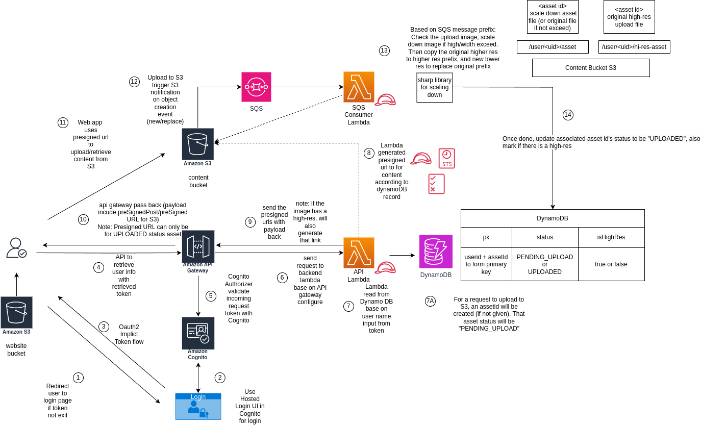

# A sample serverless site with access controlled binary

A sample serverless site with access controlled binary

**Note this is not a production ready setup, but rather an experimental setup to demonstrate some of these setup**

**This includes but not limited to the static site javascript set - up to use minimum library set to demo the points, but may not contain all necessary security check etc...**

## Overall Architecture
This is a sample app to test a severless setup where:

- A `website` S3 bucket contains the static site content serving by CloudFront
- A `content` S3 bucket to serve the authorized content through S3 presigned url base on user endpoint's AWS STS token and info (S3 prefix etc...)
- A user endpoint served up with API Gateway to backend Lambda computing to generate user's info
- The lambda computing will access the pass in user's token and backend dynamoDB info to generate AWS STS token

Some other setup (such as lambda endpoint for update certain dynamo DB field are not drawn out to keep the graph simple)




Once setup according to readme, is able to do following flow.

Overall flow:
1. User login into website secured by AWS cognito (OAuth2 web flow)
2. User login into the site, select a picture as his/her asset from local, click "upload"
3. There is API gateway secured by AWS Cognito (OAuth2 flow) and a lambda processing backend. 
4. After the backend validate user token and request, it creates a dynamodb record with the asset id with status "PENDING_UPLOAD", and create presigned post with AWS STS token to s3. The sts has a time limit with a pre-defined role/policy.
5. Browser in background get the presigned post and upload file to S3 with the sts info included in it
6. After the upload to s3 complete, s3 will send a SQS notification event (only fire on createObject (which covers new/replace of file)). There is one Lambda SQS consumer to poll SQS periodically. Once lambda receives a message.
7. The SQS handler will check the prefix and extract user id/asset id, download the image to check image width and high and scale down the image while keeping the proportion. It then push the asset-hi-res to hi-res prefix, and original/scale down to asset prefix. Delete the original one in assetraw. 
8. The SQS handler than update dynamoDB record status from "PENDING_UPLOAD" to "UPLOADED".
7. User can use "refresh asset" to check if the asset status become "UPLOADED". Once the status is "UPLOADED", the payload will include a S3 presigned url to get binary content from s3 (also secured with STS).
8. User can select image to upload to repeat above. Or delete (which will reset the asset back to pending upload status).

Note: the upload to s3 is quite quick, the reason it takes few minutes is because SQS polling is on batch for performance reason, so it takes sometime for sqs status to come in and update dynamoDB.
Note: there is restriction set on presigned post (limit time token + 5kb upload) and presigned get(time token)
Note: the scale down image logic may not be most optimal, and may wish to do additional virus scan/check before actual processing the image.

### Overall User Flow

1. User go into the website through a direct link
2. A login page from AWS cognito will be presented to user.
3. User can enter existing credential or choose to follow a login process.
4. Once login, user can choose to click on "Choose File" above "Upload New Asset" to select a file (note the file must be less than 5 MB, otherwise API will reject).
5. Once the file is select, user can choose to click on "Upload New Asset" to uploaded the selected image.
6. Under assets list, a new asset will show up under status "PENDING_UPLOAD", with "Choose File", "Upload Asset", "Refresh Asset", "Delete Asset".
7. User can click "Refresh Asset" to check status, it may take sometime for asset status to change from "PENDING_UPLOAD" to "UPLOADED".
8. Once status of an asset is "UPLOADED", it will show a preview image and a "Download Original File". If the original file has width/height greater than 1024, the link will be "Download Hi-Res Original File".
9. The preview image of asset will always be scale down so both width/height will be below 1024.
10. User can then do "Choose File" -> "Upload Asset" to update existing asset.
11. User can also click "Delete Asset" to delete all assets own by the user, first 5 assets will show up, and can click on "Next Assets" for additional 5 assets.

Note: There is one asset with id same as user id, even after removed, will always be shown as "PENDING_UPLOAD".
Note: Some flow may still have some glitches.

## Requirement Setup
Please installed following tools:
- [AWS CLI](https://docs.aws.amazon.com/cli/latest/userguide/getting-started-install.html)
- [Node.js (v14.0 or above)](https://nodejs.org/en/)
- [AWS CDK](https://docs.aws.amazon.com/cdk/v2/guide/home.html)


## Deployment

Git clone and move into the directory
```
git clone <repo>
cd <repo>
```

Install the dependency
```
npm install
```

Install dependencies for lambda
```
cd lambda_layers
npm install --arch=x64 --platform=linux sharp
npm install
cd ..
```

Setup the [AWS credentials](https://docs.aws.amazon.com/cli/latest/userguide/cli-configure-files.html)
Ensure a region is specified, as the repo does not assume any region
```
export AWS_REGION=us-west-2

```

Update the `domainPrefix` in `lib/serverless_s3_site-stack.ts` to be unique, such as `appname-website-app` otherwise may face deployment error
```
    // domain for cognito hosted endpoint
    // currently use out of box domain from cognito
    const websiteCognitDomain = websiteUserPool.addDomain('websiteCognitDomain', {
      cognitoDomain: {
        domainPrefix: 'website-app',
      },
    });
```

Deploy the `cdk bootstrap` (only need to perform for first time if region change or first time setup)
```
# If first time
cdk bootstrap
```

Deploy the stack
```
cdk deploy
```

Please continue with gather info as part of output, info will look like below
```
ServerlessS3SiteStack.WebsiteBucketName = testbucket
ServerlessS3SiteStack.WebsiteCognitoUserPoolId = testid_us-west-2
ServerlessS3SiteStack.WebsiteSignInUrl = <website sign in url>
ServerlessS3SiteStack.WebsiteUrl = https://test12.cloudfront.net
ServerlessS3SiteStack.usersapiEndpoint* = https://testapi.execute-api.us-west-2.amazonaws.com/prod/

```

## Setup

### Set up the static site
In `sites/site_config.json`

Replace following `<WebsiteSignInUrl from CDK output>` and `<usersapiEndpoint* from CDK output>` with actual values and save the change
```
{
 "signInUrl" : "<WebsiteSignInUrl from CDK output>";
 "apiEndpointUrl" : "<usersapiEndpoint* from CDK output>";
}
```

### Copy the website static content to bucket

From main folder, please 
```
cd sites
aws s3 sync . s3://<WebsiteBucketName from CDK output>/
```

## Test the setup

1. Please go to  `WebsiteSignInUrl from CDK output` from above
2. Please use `Sign Up` link to sign up with valid email and password, then follow the direction to verify the email account.
3. Then can use `update profile` to update nickname and profile or `Choose File` and then click `Upload Profile PIcture` to upload a new image

## Destroy/Clean Up
Please note all S3 contents (both website and content buckets), DynamoDB table, cognito user pools will be destroyed by default along with the stack
```
cdk destroy
```

